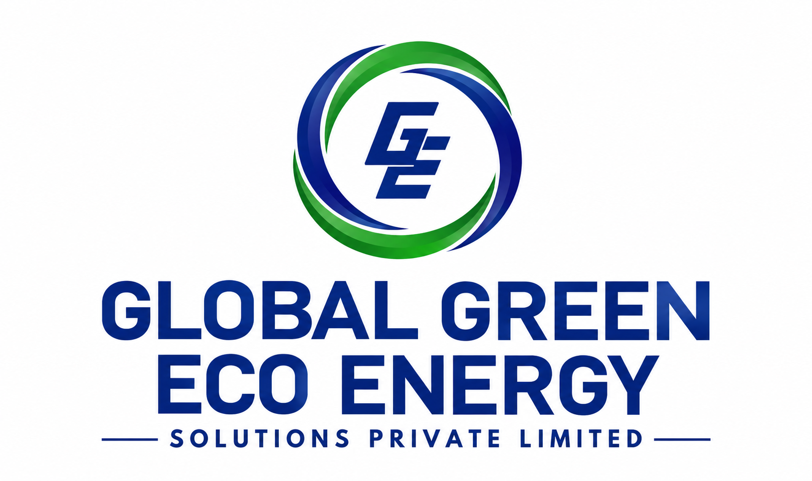

# 🌱 G2E2 — Global Green Eco Energy

### Powering a Sustainable Future

**Renewable Energy • Eco-Friendly Innovation • Sustainable Living**

---

## 🌍 About G2E2

**G2E2 (Global Green Eco Energy)** is a renewable-energy and eco-friendly business ecosystem focused on building sustainable solutions for **people, businesses, and communities**.

> 🌱 **Our Core Concept**  
> **Renewable Energy • Eco-Friendly Innovation • Sustainable Living**

---

## 🎯 Vision

To build a global ecosystem where **renewable energy and eco-friendly innovation become part of everyday life and business.**

---

## 🚀 Mission

| | Mission |
|:---:|---|
| 🌱 | **Promote renewable energy adoption** |
| ⚡ | **Build accessible EV charging infrastructure** |
| ☀️ | **Deliver practical solar-energy solutions** |
| 🌍 | **Support environmentally responsible businesses** |
| 💡 | **Develop innovative green technologies and services** |

---

## 💡 Core Values

| 🌱 **Sustainability** | ⚡ **Clean Energy** | 🌍 **Responsibility** |
|:---:|:---:|:---:|
| Long-term environmental responsibility | Cleaner and renewable energy | Responsible business practices |

| 💡 **Innovation** | 🤝 **Community** | 🚀 **Growth** |
|:---:|:---:|:---:|
| Practical green technology | Sustainable solutions for communities | Expanding the green ecosystem |

---

## 🌿 Our Ecosystem

### **G2E2**
*Global Green Eco Energy*

⬇️

**⚡ EV Charging** &nbsp; • &nbsp;
**☀️ Solar Energy** &nbsp; • &nbsp;
**🌱 Eco-Friendly Businesses** &nbsp; • &nbsp;
**💡 Green Technology**

---

## 📄 License

© **G2E2 — Global Green Eco Energy** · All rights reserved.

### 🌱 *Building a Greener Tomorrow.*

